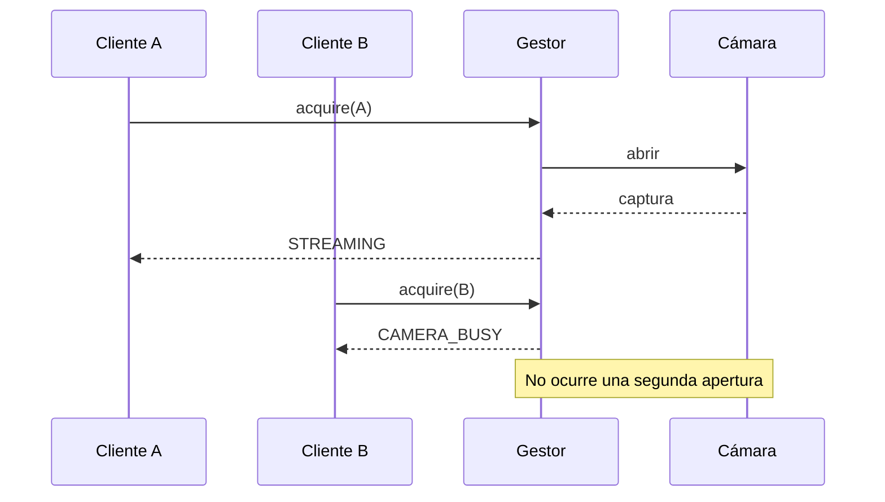
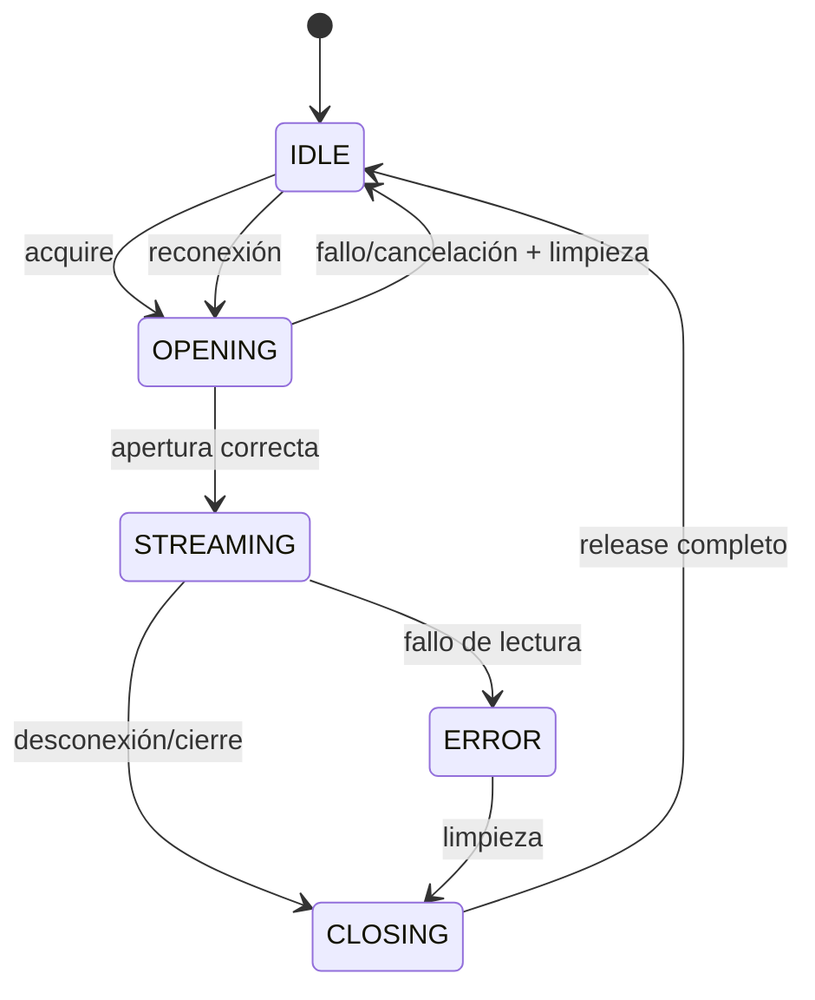

# M01 — Ciclo de vida y sincronización de la sesión de cámara

**Ticket:** OMC-82 · **Alcance:** una cámara configurada y un cliente simultáneo

## Objetivo

Este documento define el contrato técnico que deben conservar el gestor de cámara,
los WebSockets y las tareas posteriores del subsistema. El propósito es que abrir,
usar, cerrar, fallar y volver a conectar nunca creen dos propietarios del mismo
recurso ni dejen una captura sin liberar.

El gestor centralizado es el único propietario autorizado de `CameraCapture`. Los
routers solicitan una sesión y consumen el recurso, pero no abren ni liberan la
cámara directamente.

## Invariantes

1. Existe como máximo una captura abierta o en proceso de apertura/cierre.
2. Existe como máximo un `client_id` propietario de la sesión.
3. Abrir, asignar propietario, cerrar y retirar propietario se serializa con un
   único mecanismo de exclusión.
4. Un cliente que no sea el propietario no puede liberar la sesión.
5. Un segundo cliente recibe `CAMERA_BUSY` sin modificar la sesión activa.
6. Una apertura fallida o cancelada no publica una sesión parcial.
7. El recurso se libera una sola vez ante cierre normal, error o cancelación.
8. El último frame, las métricas y los errores pertenecen a la sesión que los
   produjo y se descartan cuando esa sesión termina.

## Estados

| Estado lógico | Exposición pública | Propietario | Captura | Significado |
|---|---|---:|---:|---|
| `IDLE` | `idle` | No | No | Puede comenzar una apertura. |
| `OPENING` | operación protegida | Reservado | En creación | No se admite otro cliente. |
| `STREAMING` | `streaming` | Sí | Sí | El cliente puede consumir frames. |
| `ERROR` | `error` | Sí | Sí o degradada | Se conserva la causa hasta liberar. |
| `CLOSING` | operación protegida | Sí | En liberación | No se admite una nueva apertura. |

`OPENING` y `CLOSING` son fases internas protegidas por el candado. No necesitan
publicarse como una sesión disponible, pero deben bloquear una apertura paralela.

## Transiciones y responsables

| Origen | Evento | Destino | Responsable | Acción obligatoria |
|---|---|---|---|---|
| `IDLE` | `acquire(client)` | `OPENING` | Gestor | Tomar el candado y reservar la operación. |
| `OPENING` | apertura correcta | `STREAMING` | Gestor | Publicar captura, propietario, métricas y estado juntos. |
| `OPENING` | fallo de apertura | `IDLE` | Gestor | Liberar cualquier captura parcial y devolver `CAMERA_UNAVAILABLE`. |
| `OPENING` | cancelación | `IDLE` | Gestor | Esperar la apertura en curso y cerrar el resultado huérfano. |
| `STREAMING` | segundo cliente | `STREAMING` | Gestor | Devolver `CAMERA_BUSY`; no abrir hardware. |
| `STREAMING` | frame válido | `STREAMING` | Sesión | Reemplazar último frame y actualizar métricas. |
| `STREAMING` | error de lectura | `ERROR` | Sesión | Registrar causa y detener la publicación de frames. |
| `STREAMING`/`ERROR` | `release(owner)` | `CLOSING` | Gestor | Impedir nuevas aperturas y liberar exactamente una vez. |
| `CLOSING` | cierre completo | `IDLE` | Gestor | Retirar sesión y propietario. |
| cualquier estado activo | apagado | `CLOSING` → `IDLE` | Gestor | Ejecutar el mismo cierre ordenado. |

Una reconexión nunca salta de `ERROR` a `STREAMING` sobre una captura incierta.
Primero completa `ERROR → CLOSING → IDLE`; después inicia una apertura nueva.

## Propiedad de los datos

La sesión agrupa datos que deben cambiar de forma coherente:

- `capture`: único recurso físico o fuente de video abierta;
- `active_client`: token del propietario;
- `last_frame` y `last_frame_ts`: frame más reciente de esa sesión (desde M06,
  `last_frame` se lee del `FrameSlot`, la única copia retenida);
- métricas: frames capturados, descartados, FPS y tiempo activo;
- errores: historial acotado con causa y momento;
- estado: vista pública de la fase estable actual.

Ningún consumidor conserva autoridad sobre estos datos después de `release()`.

## Sincronización

`CameraSessionManager` usa un `asyncio.Lock` común para `acquire`, `release`,
`shutdown` y el escaneo que pueda tocar el dispositivo. La condición “está libre”
y la apertura forman una sola operación protegida; no se aplica un patrón de
comprobar y actuar fuera del candado.

Las llamadas bloqueantes del controlador se ejecutan fuera del event loop, pero el
candado lógico permanece tomado hasta conocer el resultado. Si la corrutina se
cancela durante una apertura, el resultado tardío se considera huérfano y debe
cerrarse antes de permitir que otra apertura se solape.

`release(client_id)` valida el token de propiedad. Una desconexión vieja o una
tarea duplicada no puede cerrar la sesión de otro cliente.

## Secuencias críticas

### Dos clientes simultáneos



### Error y reconexión



## Errores controlados

| Código | Situación | Efecto sobre la sesión activa |
|---|---|---|
| `CAMERA_BUSY` | Ya existe propietario o una operación de cierre/apertura. | Ninguno. |
| `CAMERA_UNAVAILABLE` | El controlador no pudo abrir la fuente. | No se publica sesión parcial. |
| `CAMERA_NO_FRAMES` | La fuente activa dejó de producir frames. | Pasa a `ERROR` y después se libera. |
| `CAMERA_READ_ERROR` | El controlador lanzó durante la lectura. | Registra la causa y ejecuta cierre ordenado. |

## Correspondencia con el código actual

- `CameraSessionManager` concentra la propiedad y la sincronización.
- `CameraSession` contiene estado, último frame, métricas y errores.
- `SessionBusyError` y `SessionCameraError` representan rechazos controlados.
- El `client_id` identifica al único propietario autorizado para liberar.
- `get_status()` expone una instantánea sin entregar el recurso de captura.

Las tareas posteriores pueden ampliar captura, reconexión o métricas, pero deben
conservar los invariantes y transiciones descritos aquí.

## Verificación sin cámara física

```bash
cd backend
python -m pytest -q tests/test_m01_session_lifecycle_contract.py
python scripts/demo_m01_lifecycle.py
```

La prueba y la demostración sustituyen `open_camera` por una captura simulada. No
abren hardware, no cargan modelos y no realizan conexiones de red.

## Lista de revisión

- [ ] Solo el gestor abre y libera `CameraCapture`.
- [ ] Apertura y cierre permanecen protegidos por el mismo candado.
- [ ] Un segundo cliente obtiene `CAMERA_BUSY` sin efectos laterales.
- [ ] Fallos y cancelaciones no publican sesiones parciales.
- [ ] Solo el propietario puede liberar.
- [ ] El cierre ocurre exactamente una vez.
- [ ] Una nueva conexión solo se acepta después de completar la limpieza.
- [ ] Estado, frame, métricas y errores pertenecen a la misma sesión.
